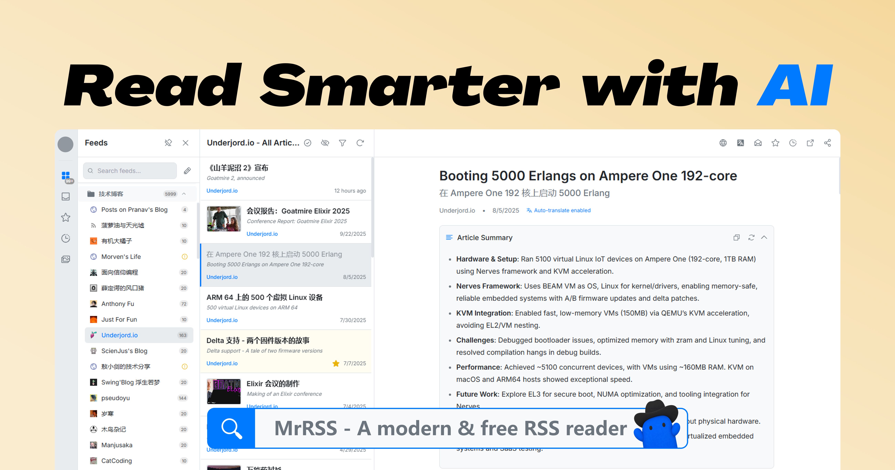

<h1>&nbsp;MrRSS</h1>

<a href="https://trendshift.io/repositories/15731" target="_blank"></a>



<p>
   <a href="README.md">English</a> | <strong>简体中文</strong>
</p>

> **本分支构建 macOS 客户端。** 界面为 `frontend` 中的原生 SwiftUI 应用，
> Go 后端作为纯 HTTP API 服务运行。本分支不包含 Vue 前端与 Wails 外壳。

[](https://github.com/DevXDojo/MrRSS/releases)
[](LICENSE)
[](https://go.dev/)
[](https://swift.org/)
[](https://www.apple.com/macos/)

## ✨ 功能特性

- 🌐 **自动翻译与摘要**: 自动翻译文章标题与正文，并生成简洁的内容摘要，助你快速获取信息
- 🤖 **AI 增强功能**: 集成先进 AI 技术，赋能翻译、摘要、推荐等多种功能，并支持通过 skill 读取与操作
- 🔌 **丰富的插件生态**: 支持 Obsidian、Notion、FreshRSS、RSSHub 等主流工具集成，轻松扩展功能
- 📡 **多样化订阅方式**: 支持 URL、XPath、脚本、Newsletter 等多种订阅源类型，满足不同需求
- 🏭 **自定义脚本与自动化**: 内置过滤器与脚本系统，支持高度自定义的自动化流程

## 🚀 快速开始

### 下载与安装

#### 选项 1: 下载预构建安装包（推荐）

从 [Releases](https://github.com/DevXDojo/MrRSS/releases/latest) 页面下载适合您平台的最新安装包。

<details>

<summary>点击查看可用的安装包列表</summary>

<div markdown="1">

**标准安装版：**

- **Windows:** `MrRSS-{version}-windows-amd64-installer.exe` / `MrRSS-{version}-windows-arm64-installer.exe`
- **macOS:** `MrRSS-{version}-darwin-universal.dmg`
- **Linux:** `MrRSS-{version}-linux-amd64.AppImage` / `MrRSS-{version}-linux-arm64.AppImage`

**便携版**（无需安装，所有数据在一个文件夹内）：

- **Windows:** `MrRSS-{version}-windows-{arch}-portable.zip`
- **Linux:** `MrRSS-{version}-linux-{arch}-portable.tar.gz`
- **macOS:** `MrRSS-{version}-darwin-{arch}-portable.zip`

**AI Agent Skills：**

- **Codex:** `MrRSS-{version}-skills.zip`（[使用说明](docs/SKILLS.zh.md)）

</div>

</details>

#### 选项 2: 源码构建

<details>

<summary>点击展开源码构建指南</summary>

<div markdown="1">

##### 前置要求

- [Go](https://go.dev/) 1.27 或更高版本
- macOS 14 或更高版本
- Xcode 15 或更高版本（提供 Swift 工具链）

详细说明请参见[构建要求](docs/BUILD_REQUIREMENTS.md)。

##### 安装步骤

1. **克隆仓库**

   ```bash
   git clone https://github.com/DevXDojo/MrRSS.git
   cd MrRSS
   ```

2. **运行客户端**

   ```bash
   ./frontend/run.sh
   ```

   该脚本会构建 Go 后端，在 `http://127.0.0.1:1234` 启动并等待 API 就绪，
   随后启动客户端。若该地址已有服务在运行，则直接复用。

3. **也可以分别运行两部分**

   ```bash
   go run . -host 127.0.0.1 -port 1234
   swift run --package-path frontend MrRSS
   ```

   后端地址可在设置中修改，也可在启动前指定：

   ```bash
   MRRSS_API_BASE_URL=http://127.0.0.1:8080/api swift run --package-path frontend MrRSS
   ```

4. **构建应用程序包**

   ```bash
   make build-app VERSION=1.3.28
   ```

   构建结果为 `frontend/dist/MrRSS-SwiftUI.app` 及同目录下的通用架构 DMG。
   该应用包内含后端程序，无需另行安装服务端即可启动。

</div>

</details>

### 服务器模式

<details>

<summary>点击展开服务器模式说明</summary>

<div markdown="1">

Go 程序本身即为 HTTP API 服务。可单独部署以便在多台设备间共享同一份订阅数据，
并在客户端设置中填写其地址：

```bash
go build -o mrrss-server .
./mrrss-server -host 0.0.0.0 -port 1234
```

也可使用 Docker 镜像：

```bash
docker build -f Dockerfile.server -t mrrss-server:latest .
docker run -p 1234:1234 -v $PWD/data:/app/data mrrss-server:latest
```

API 文档见 [docs/SERVER_MODE/swagger.json](docs/SERVER_MODE/swagger.json)。

</div>

</details>


### 数据存储

<details>

<summary>点击展开数据存储说明</summary>

<div markdown="1">

**正常模式**（默认）：

- **Windows:** `%APPDATA%\MrRSS\` (例如 `C:\Users\YourName\AppData\Roaming\MrRSS\`)
- **macOS:** `~/Library/Application Support/MrRSS/`
- **Linux:** `~/.local/share/MrRSS/`

**便携模式**（当 `portable.txt` 文件存在时）：

- 所有数据存储在 `data/` 文件夹中

这确保了您的数据在应用更新和重新安装时得以保留。

</div>

</details>

## 🛠️ 开发指南

<details>

<summary>点击展开开发指南</summary>

<div markdown="1">

### 开发模式运行

启动带有热重载的应用：

```bash
# 同时启动后端与客户端
make dev

# 仅启动后端（开启调试日志）
make serve

# 仅启动客户端，连接已运行的后端
swift run --package-path frontend MrRSS
```

### 代码质量工具

#### 使用 Make

我们提供了 `Makefile` 来处理常见的开发任务（在 Linux/macOS/Windows 上都可用）：

```bash
# 显示所有可用命令
make help

# 运行完整检查（lint + 测试 + 构建）
make check

# 清理构建产物
make clean

# 设置开发环境
make setup
```

### Pre-commit Hooks

本项目使用 pre-commit hooks 来确保代码质量：

```bash
# 安装 hooks
pre-commit install

# 在所有文件上运行
pre-commit run --all-files
```

### 运行测试

```bash
make test
```

### 本地 API 与服务器模式

桌面应用运行时会在 `http://localhost:1234/api` 提供 REST API。该监听器仅允许
本机访问。

对于服务器部署和 API 集成，请使用无界面服务器版本：

```bash
# 使用 Docker（推荐）
docker run -p 1234:1234 mrrss-server:latest

# 或从源码构建
go build -o mrrss-server .
./mrrss-server
```

本项目也提供了基于 ghcr.io 的预构建服务器镜像：

```bash
docker run -d -p 1234:1234 ghcr.io/devxdojo/mrrss:latest-amd64
docker run -d -p 1234:1234 ghcr.io/devxdojo/mrrss:latest-arm64
```

请参阅[服务器模式 API 文档](docs/SERVER_MODE/swagger.json)以获取完整的 API 参考。
如需让 Codex 通过该 API 操作 MrRSS，请安装 release 中的 skills 包，详见 [MrRSS Skills](docs/SKILLS.zh.md)。

</div>

</details>

## 🤝 贡献

我们欢迎贡献！详情请参阅我们的[贡献指南](CONTRIBUTING.md)。

<details>

<summary>点击展开贡献指南</summary>

<div markdown="1">

在贡献之前：

1. 阅读[行为准则](CODE_OF_CONDUCT.md)
2. 检查现有 issue 或创建一个新 issue
3. Fork 仓库并创建功能分支
4. 进行更改并添加测试
5. 提交 Pull Request

</div>

</details>

## 🔒 安全

如果您发现安全漏洞，请遵循我们的[安全策略](SECURITY.md)。

## 📝 许可证

本项目采用 GPL-3.0 许可证 - 详情请参阅 [LICENSE](LICENSE) 文件。

## 📮 联系与支持

- **Issues**: [GitHub Issues](https://github.com/DevXDojo/MrRSS/issues)
- **讨论**: [GitHub Discussions](https://github.com/DevXDojo/MrRSS/discussions)
- **仓库**: [github.com/DevXDojo/MrRSS](https://github.com/DevXDojo/MrRSS)

<div align="center">
  
  <p>Made with ❤️ by the MrRSS Team</p>
  <p>⭐ 如果您觉得这个项目有用，请在 GitHub 上给我们点星！</p>
</div>
